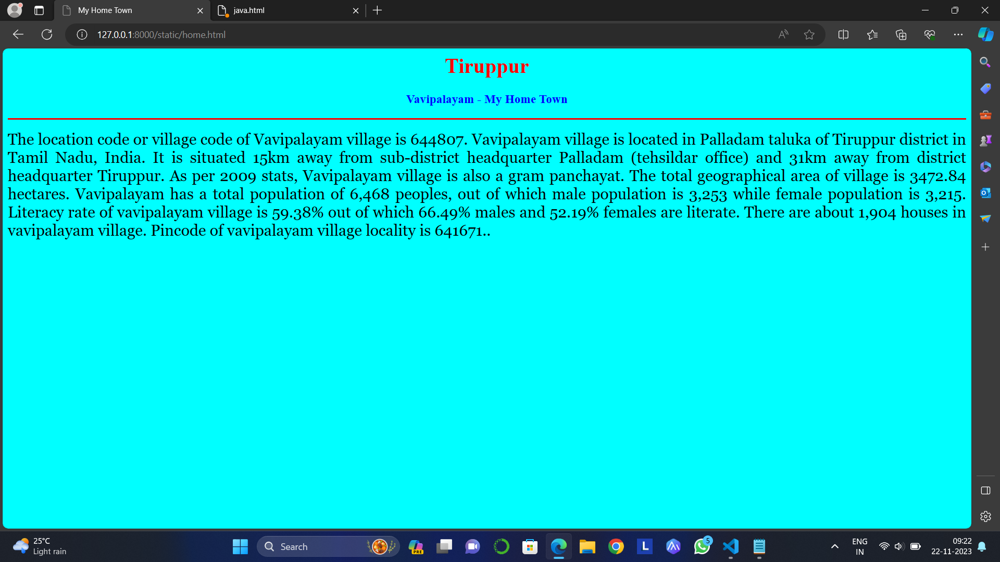
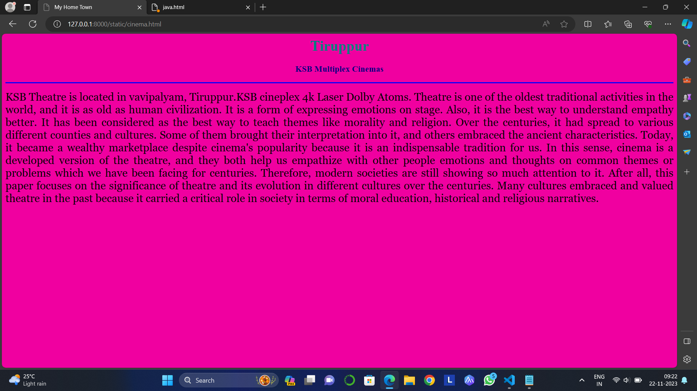
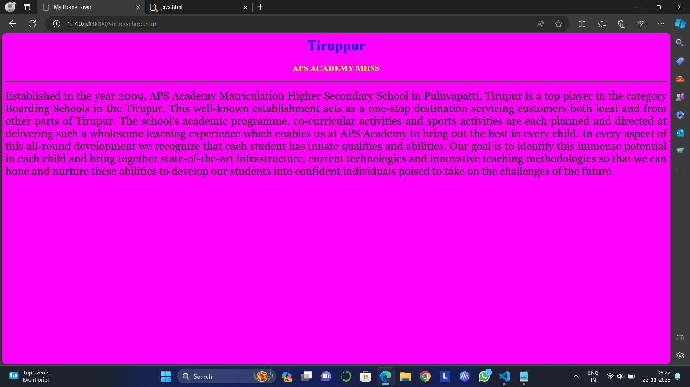
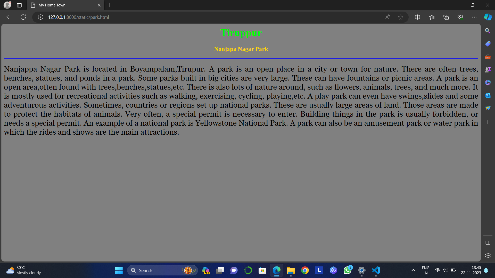

# Ex04 Places Around Me
## Date: 20/11/2023

## AIM
To develop a website to display details about the places around my house.

## DESIGN STEPS

### STEP 1
Create a Django admin interface.

### STEP 2
Download your city map from Google.

### STEP 3
Using ```<map>``` tag name the map.

### STEP 4
Create clickable regions in the image using ```<area>``` tag.

### STEP 5
Write HTML programs for all the regions identified.

### STEP 6
Execute the programs and publish them.

## CODE
```
map.html

<html>
    <head>
        <title>My City</title>
    </head>
    <body>
        <h1 align="center">
        <font color="red"><b>Vavipalayam</b></font>
    </h1>
    <h3 align="center">
        <font color="blue"><b>Kishan Shree B (23012867)</b></font>
    </h3>
    <center>
        
        <map name="MyCity">
            <area shape="rect" coords="1100,100,1150,150" href="home.html" title="My Home Town">
            <area shape="rect" coords="1050,290,1120,340" href="cinema.html" title="KSB multiplex cinemas">
         <area shape="rect" coords="550,220,650,280" href="school.html" title="APS Academy MHSS">
         <area shape="rect" coords="330,430,380,480" href="park.html" title="Nanjappa Nagar Park">
         <area shape="rect" coords="850,100,900,150" href="hospital.html" title="Government Hospital">
        </map>
    </center>
    </body>
</html>

home.html
<html>
<head>
    <title>My Home Town</title>
</head>
<body bgcolor="cyan">
    <h1 align="center">
        <font color="red"><b>Tiruppur</b></font>
    </h1>
    <h3 align="center">
        <font color="blue"><b>Vavipalayam - My Home Town</b></font>
    </h3>
    <hr size="3" color="red">
    <p align="justify">
        <font face="Georgia" size="5">
             The location code or village code of Vavipalayam village is 644807. Vavipalayam village is located in Palladam taluka of Tiruppur district in Tamil Nadu, India. It is situated 15km away from sub-district headquarter Palladam (tehsildar office) and 31km away from district headquarter Tiruppur. As per 2009 stats, Vavipalayam village is also a gram panchayat.

         The total geographical area of village is 3472.84 hectares. Vavipalayam has a total population of 6,468 peoples, out of which male population is 3,253 while female population is 3,215. Literacy rate of vavipalayam village is 59.38% out of which 66.49% males and 52.19% females are literate. There are about 1,904 houses in vavipalayam village. Pincode of vavipalayam village locality is 641671..

        </font>
    </p>
</body>

</html>
cinema.html
<html>
<head>
    <title>My Home Town</title>
</head>
<body bgcolor="fushsia">
    <h1 align="center">
        <font color="teal"><b>Tiruppur</b></font>
    </h1>
    <h3 align="center">
        <font color="navy"><b>KSB Multiplex Cinemas</b></font>
    </h3>
    <hr size="3" color="blue">
    <p align="justify">
        <font face="Georgia" size="5">
         KSB Theatre is located in vavipalyam, Tiruppur.KSB cineplex 4k Laser Dolby Atoms. Theatre is one of the oldest traditional activities in the world, and it is as old as human civilization. It is a form of expressing emotions on stage. Also, it is the best way to understand empathy better. It has been considered as the best way to teach themes like morality and religion. Over the centuries, it had spread to various different counties and cultures. Some of them brought their interpretation into it, and others embraced the ancient characteristics. Today, it became a wealthy marketplace despite cinema's popularity because it is an indispensable tradition for us. In this sense, cinema is a developed version of the theatre, and they both help us empathize with other people emotions and thoughts on common themes or problems which we have been facing for centuries. Therefore, modern societies are still showing so much attention to it. After all, this paper focuses on the significance of theatre and its evolution in different cultures over the centuries. Many cultures embraced and valued theatre in the past because it carried a critical role in society in terms of moral education, historical and religious narratives.
        </font>
    </p>
</body>

</html>
school.html
<html>
<head>
    <title>My Home Town</title>
</head>
<body bgcolor="magenta">
    <h1 align="center">
        <font color="blue"><b>Tiruppur</b></font>
    </h1>
    <h3 align="center">
        <font color="yellow"><b>APS ACADEMY MHSS</b></font>
    </h3>
    <hr size="3" color="green">
    <p align="justify">
        <font face="Georgia" size="5">
            Established in the year 2009, APS Academy Matriculation Higher Secondary School in Puluvapatti, Tirupur is a top player in the category Boarding Schools in the Tirupur. This well-known establishment acts as a one-stop destination servicing customers both local and from other parts of Tirupur.
            The school's academic programme, co-curricular activities and sports activities are each planned and directed at delivering such a wholesome learning experience which enables us at APS Academy to bring out the best in every child. In every aspect of this all-round development we recognize that each student has innate qualities and abilities. Our goal is to identify this immense potential in each child and bring together state-of-the-art infrastructure, current technologies and innovative teaching methodologies so that we can hone and nurture these abilities to develop our students into confident individuals poised to take on the challenges of the future.
        </font>
    </p>
</body>

</html>
park.html
<html>
<head>
    <title>My Home Town</title>
</head>
<body bgcolor="gray">
    <h1 align="center">
        <font color="lime"><b>Tiruppur</b></font>
    </h1>
    <h3 align="center">
        <font color="gold"><b>Nanjapa Nagar Park</b></font>
    </h3>
    <hr size="3" color="blue">
    <p align="justify">
        <font face="Georgia" size="5">
            Nanjappa Nagar Park is located in Boyampalam,Tirupur.
            A park is an open place in a city or town for nature. There are often trees, benches, statues, and ponds in a park. Some parks built in big cities are very large. These can have fountains or picnic areas.
            A park is an open area,often found with trees,benches,statues,etc. There is also lots of nature around, such as flowers, animals, trees, and much more. It is mostly used for recreational activities such as walking, exercising, cycling, playing,etc. A play park can even have swings,slides and some adventurous activities.
            Sometimes, countries or regions set up national parks. These are usually large areas of land. Those areas are made to protect the habitats of animals. Very often, a special permit is necessary to enter. Building things in the park is usually forbidden, or needs a special permit.
            An example of a national park is Yellowstone National Park.
            A park can also be an amusement park or water park in which the rides and shows are the main attractions.
        </font>
    </p>
</body>

</html>
hospital.html
<html>
<head>
    <title>My Home Town</title>
</head>
<body bgcolor="purple">
    <h1 align="center">
        <font color="skyblue"><b>Tiruppur</b></font>
    </h1>
    <h3 align="center">
        <font color="pink"><b>Government Hospital</b></font>
    </h3>
    <hr size="3" color="blue">
    <p align="justify">
        <font face="Georgia" size="5">
            A public hospital, or government hospital, is a hospital which is government owned and is fully funded by the government and operates solely off the money that is collected from taxpayers to fund healthcare initiatives. In some countries, this type of hospital provides medical care free of charge to patients, covering expenses and wages by government reimbursement.

            The level of government owning the hospital may be local, municipal, state, regional, or national, and eligibility for service, not just for emergencies, may be available to non-citizen residents.
        </font>
    </p>
</body>

</html>
```

## OUTPUT







## RESULT
The program for implementing image maps using HTML is executed successfully.
